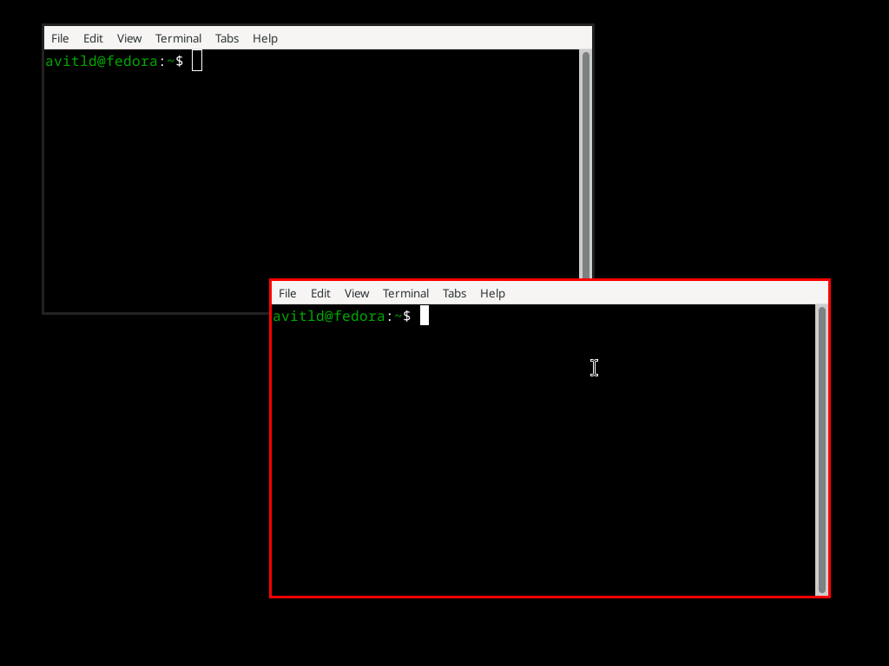

# trancewm
A small window manager I made in python

This is a very bad and buggy window manager I tried to make in python. It's configurable in config.py and by default uses xfce4-terminal as the terminal
I made this in the span of an hour and built it based on the python version of tinyWM.

What works:
- Moving/Resizing windows
- Closing windows
- Maximizing/Unmaximizing windows

What doesn't work:
- Proper focusing

You can run the WM in a xephyr session by running `preview.sh`

feel free to contribute (although why would anyone contribute to this mess)

anyways this isn't meant to really be used, unless I update it to be more usable in the future so don't take it too seriously, I just made this for fun to mess around with xlib and python

